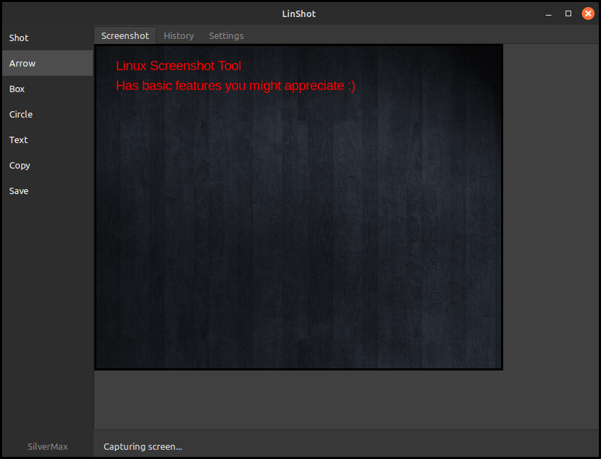
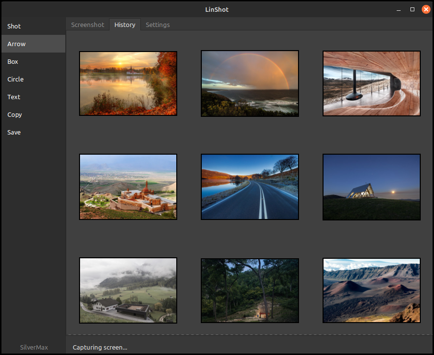
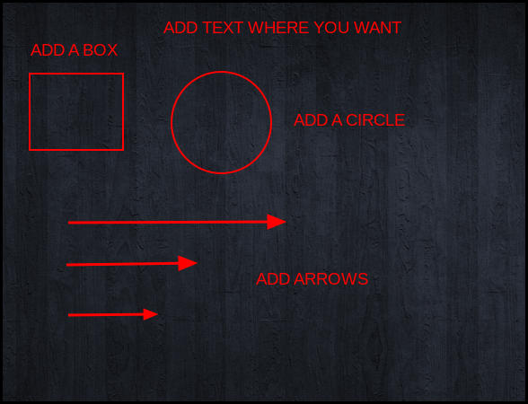

# LinShot

LinShot is a modern, open-source screenshot tool for Linux desktops, created with popular annotation features such as simple freeform arrows, boxes, circles, and more. It features a clean, modular codebase and a robust overlay system for capturing screenshots with precision.

## Features
- **Full-Screen and Area Capture:** Select the entire screen or a custom area with visual feedback.
- **Modern Linux Support:** Designed for compatibility with a wide range of Linux desktop environments.
- **Modular Architecture:** Easy to extend and modify, with clear separation of features.
- **Open Source:** Free to use for education, personal projects, and non-commercial applications.

## Screenshots

### Main View & Screenshot Editing

*The main application window, showing the screenshot tab with editing tools.*

### Screenshot History

*The history tab, displaying previously captured screenshots for easy access.*

### Annotation Examples

*Examples of annotation tools: arrows, boxes, circles, and text added to a screenshot.*

## Development Status
LinShot is **actively in development**. Features and user experience will continue to improve over time. Community feedback and contributions are welcome!

## Repository
[GitHub: MaxSilver22/linshot-screenshot-tool](https://github.com/MaxSilver22/linshot-screenshot-tool)

## License
See [LICENSE](LICENSE) for details on usage and distribution. 